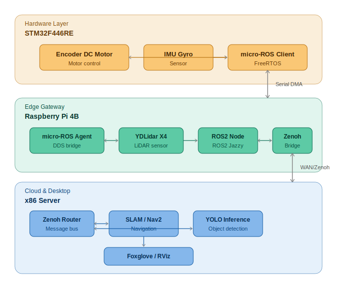

# COMMAND CENTER 🤖

**Autonomous Inventory Replenishment System using AMR**

An autonomous mobile robot (AMR) system designed for warehouse-to-shelf logistics automation. The robot navigates autonomously using LiDAR-based SLAM, detects inventory using YOLO object detection, and replenishes shelves without human intervention.

---

## 📌 Project Overview

| Item | Detail |
|---|---|
| Project Type | Capstone Design Project |
| Period | Sep 2025 – Aug 2026 |
| Team | 5 members |
| Role | Team Lead |
| Status | Hardware 90% complete / Display system in development |

---

## 🏗️ System Architecture




---

## 🛠️ Tech Stack

**Embedded**
- STM32F446RE (ARM Cortex-M4)
- micro-ROS (ROS2 firmware framework for MCU)
- FreeRTOS
- UART / Serial DMA communication

**Robotics**
- ROS2 (Jazzy)
- Nav2 (Autonomous Navigation)
- SLAM Toolbox (Mapping)
- YDLidar X4
- Gazebo (Simulation)
- RViz / Foxglove (Visualization)
- YOLO (Object Detection)
- Zenoh (DDS Bridge / WAN communication)

**Tools**
- Docker
- Linux (Ubuntu)
- Git
- Python / C/C++

---

## 🔧 Key Development Highlights

### Hardware Debugging
- Diagnosed erratic motor encoder readings caused by missing common ground between STM32 and motor driver; resolved by establishing proper ground connection and restoring stable motor control

### Software Debugging
- Resolved `/joint_states` data contention between hardware driver and simulation nodes by separating launch file execution, enabling stable real-robot RViz integration
- Diagnosed MCU-to-host communication failure via micro-ROS Agent by inspecting internal node topology; identified duplicate STM32 nodes as root cause and resolved through firmware configuration fix

### System Design
- Implemented 3-layer architecture (STM32 MCU / Raspberry Pi Linux host / x86 monitoring server)
- Refactored launch file into 3 modular configurations (simulation / Nav2 / SLAM)
- Validated navigation stack in Gazebo simulation before deploying to physical hardware
- Migrated full ROS2 stack from x86 to Raspberry Pi 4B for onboard edge computing

---

## 📁 Repository Structure

```
command_center/
├── command_center_bringup/     # Launch files (sim / nav2 / slam)
├── command_center_description/ # URDF & robot model
├── command_center_hal/         # Hardware abstraction layer
└── README.md
```

---

## 🚀 Getting Started

> ⚠️ Code upload in progress. Will be updated soon.

---

## 📷 Demo

> Gazebo simulation screenshots and real-world demo videos coming soon.
